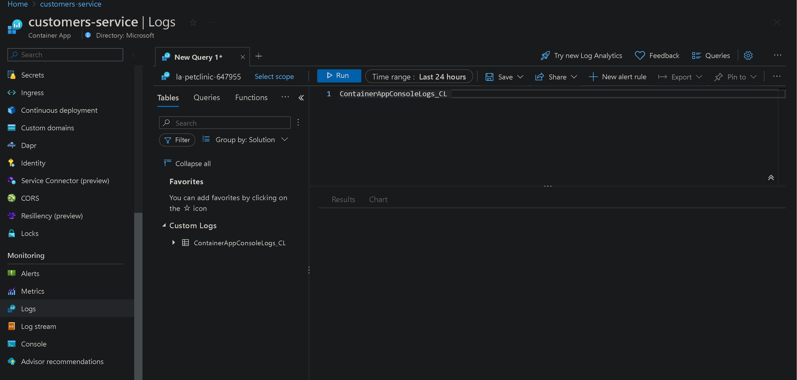

# Configure ACA monitoring

Point in time info of your Azure container app is nice, however, it is also beneficial to have overall monitoring data available. For this you can enable logs on azure container app environment.Container Apps application logs consist of two different categories:

Container console output (stdout/stderr) messages.
System logs generated by Azure Container Apps.
Spring App console logs.

Enable logging on your Azure container app environment. You can follow the below guidance to do so.

- [Log storage and monitoring options in Azure Container Apps](https://learn.microsoft.com/azure/container-apps/log-options)
- [Create a Log Analytics workspace](https://learn.microsoft.com/azure/azure-monitor/logs/quick-create-workspace?tabs=azure-cli)

## Step by step guidance

1. In your bash shell, create a Log Analytics workspace.
 
   ```bash
   WORKSPACE=la-$APPNAME-$UNIQUEID
   az monitor log-analytics workspace create \
       --resource-group $RESOURCE_GROUP \
       --workspace-name $WORKSPACE
      
   ```

1. Enable logging on azure container app environment.

   ```bash
   WORKSPACECID=$(az monitor log-analytics workspace show -n $WORKSPACE -g $RESOURCE_GROUP --query customerId -o tsv)

   WORKSPACEKEY=$(az monitor log-analytics workspace get-shared-keys -n $WORKSPACE -g $RESOURCE_GROUP --query primarySharedKey -o tsv)

   az containerapp env update \
       --name $ACA_ENVIRONMENT \
       --resource-group $RESOURCE_GROUP \
       --logs-destination log-analytics \
       --logs-workspace-id $WORKSPACECID \
       --logs-workspace-key $WORKSPACEKEY
   
   ```


1. To verify that monitoring data is available in your Log Analytics workspace, in your browser, navigate to your ACA instance in the Azure Portal. Select `Logs`. You can inspect here the monitoring data in your app.

    
