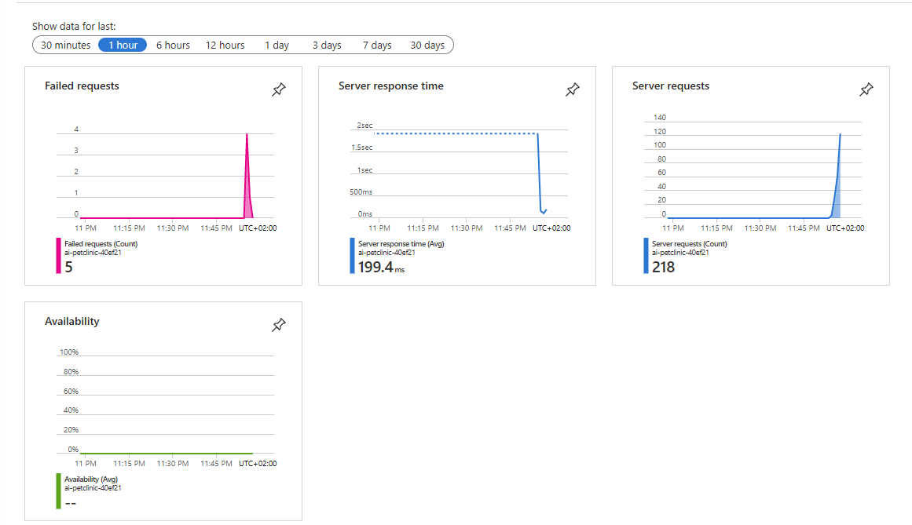
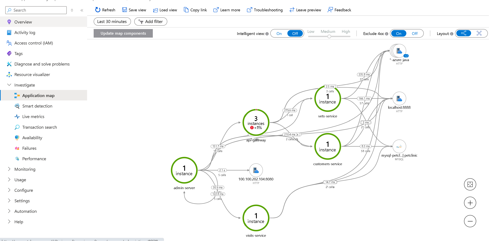
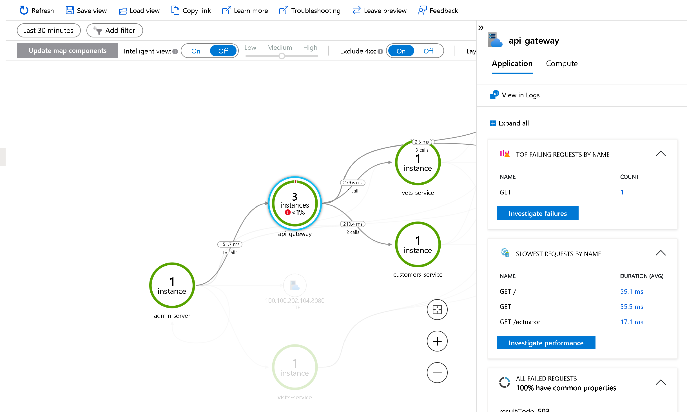
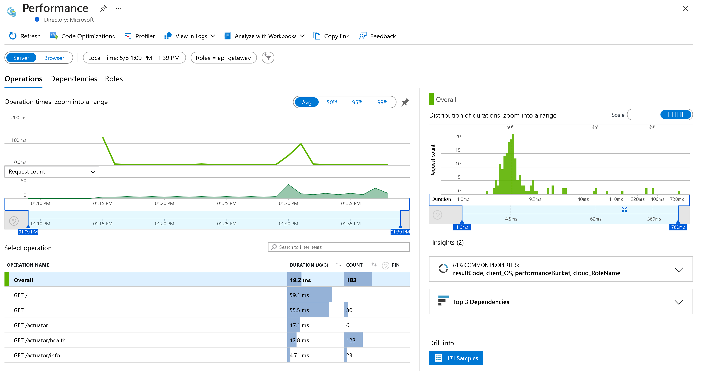
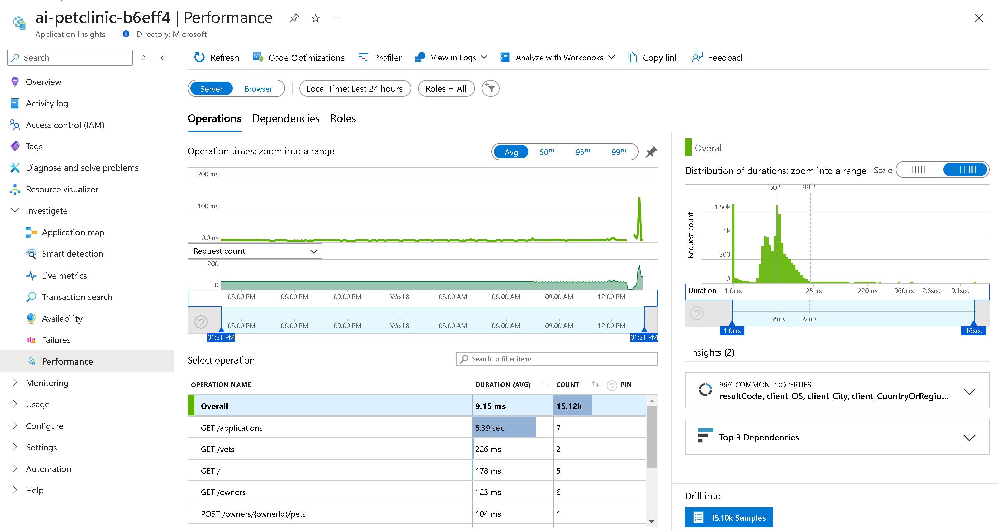

# Analyze application specific monitoring data

Now that Application Insights is properly configured, you can use this service to monitor what is going on in your application. You can follow the below guidance to do so.

- [Application Insights Overview dashboard](https://learn.microsoft.com/azure/azure-monitor/app/overview-dashboard)

Use this guidance to take a look at:
- The Application Map
- Performance data
- Failures
- Metrics
- Live Metrics
- Availability
- Logs

To get the logging information flowing, you should navigate to your application and to the different sub-pages and refresh each page a couple of times. It might take some time to update Application Insights with information from your application.

## Step by step guidance

1. In your browser, navigate to the Azure Portal and your resource group.

1. Select the Application Insights resource in the resource group. On the overview page you will already see data about Failed requests, Server response time, Server requests and Availability.

   

1. Select _Application map_. This will show you information about the different applications running in your Spring Cloud Service and their dependencies. This is where the role names you configured in the YAML files are used.

   

1. Select the _api-gateway_ service. This will show you details about this application, like slowest requests and failed dependencies.

   

1. Select _Investigate performance_. This will show you more data on performance. 

   

1. You can also drag your mouse on the graph to select a specific time period, and it will update the view.

1. Select again your Application Insights resource to navigate back to the _Application map_ and the highlighted _api-gateway_ service.

1. Select _Live Metrics_, to see live metrics of your application. This will show you near real time performance of your application, as well as the logs and traces coming in

   

1. Select _Availability_, and next _Create Standard test_, to configure an availability test for your application.

1. Fill out the following details and select _Create_: 

   - *Test name*: Name for your test
   - *URL*: Fill out the URL to your api-gateway
   - Keep all the default settings for the rest of the configuration. Notice that Alerts for this test will be enabled.

   Once created every 5 minutes your application will now be pinged for availability from 5 test locations.

1. Select the three dots on the right of your newly created availability test and select _Open Rules (Alerts) page_.

1. Select the alert rule for your availability test. By default there are no action groups associated with this alert rule. We will not configure them in this lab, but just for your information, with action groups you can send email or SMS notifications to specific people or groups.
    
   - [Create and manage action groups in the Azure portal](https://docs.microsoft.com/en-us/azure/azure-monitor/alerts/action-groups) 

1. Navigate back to your Application Insights resource.

1. Select _Failures_, to see information on all failures in your applications. You can click on any of the response codes, exception types or failed dependencies to get more information on these failures.

   

1. Select _Performance_, to see performance data of your applications' operations. This will be a similar view to the one you looked at earlier.

   

1.  Select _Logs_, to see all logged data. You can use Kusto Query Language (KQL) queries to search and analyze the logged data
    
   * [Log queries in Azure Monitor](https://docs.microsoft.com/en-us/azure/azure-monitor/logs/log-query-overview) 

   {:style="counter-reset:step-counter 16"}
1.  Select _Queries_ and next _Performance_.

1.  Double click _Operations performance_. This will load this query in the query window.

1.  Select _Run_, to see the results of this query.

   

